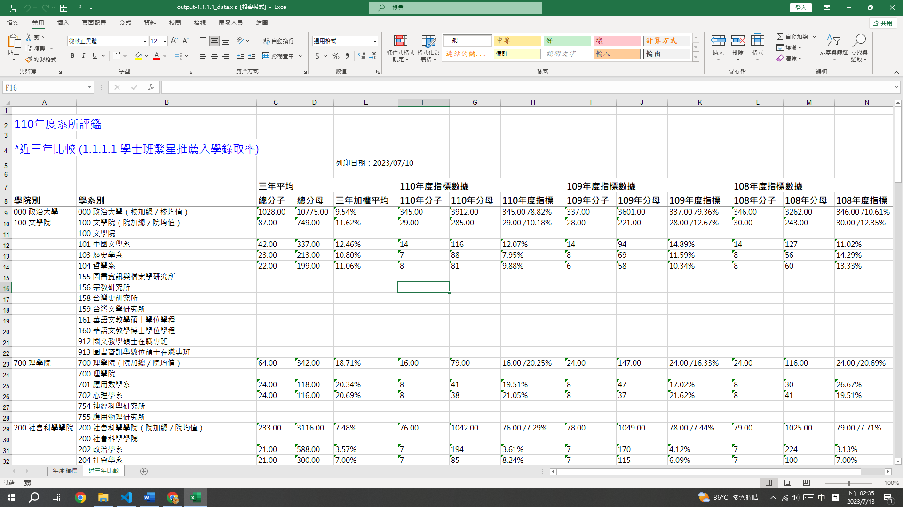

# 指標報告書自動化程式 作業說明

## 零、重要連結

- [下載新空白專案](https://minhaskamal.github.io/DownGit/#/home?url=https:%2F%2Fgithub.com%2Fchenshenyi%2FIndex-Evaluation-Analysis-Report%2Ftree%2Fmain%2Ftemplate)
可能會出現警告，但可以放心繼續下載。

- [下載範例資料](https://minhaskamal.github.io/DownGit/#/home?url=https:%2F%2Fgithub.com%2Fchenshenyi%2FIndex-Evaluation-Analysis-Report%2Ftree%2Fmain%2Fexample)

- [專案GitHub](https://github.com/chenshenyi/Index-Evaluation-Analysis-Report/)

## 壹、程式功能簡介

### 一、匯入原始資料至 Excel

1. 根據 [B 參數](B%20參數.xlsx)中各院與各指標生成 [Excel 檔案](1.%20各院彙整資料/)。
2. 將[原始資料](0.%20原始資料/)輸入至[各院彙整資料 Excel 檔案](1.%20各院彙整資料/)中。

| 原始資料 |
| -------- |
||

### 二、將原始資料輸入至指標報告書
