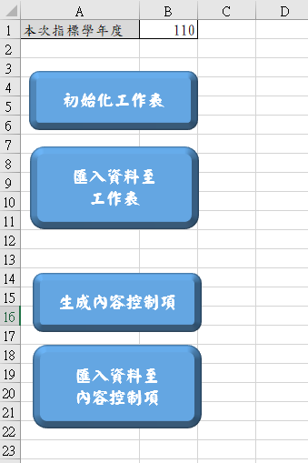

# 指標報告書自動化程式 作業說明

## 目錄

- [零、重要連結](#零重要連結)
  - [資料夾結構](#資料夾結構)
- [壹、程式功能簡介](#壹程式功能簡介)
  - [一、匯入原始資料至 Excel](#一匯入原始資料至-excel)
  - [二、將 Excel 圖表輸入至指標報告書](#二將-excel-圖表輸入至指標報告書)
- [貳、程式使用說明](#貳程式使用說明)
  - [一、初始化工作表](#一初始化工作表)
  - [二、匯入原始資料至工作表](#二匯入原始資料至工作表)
  - [三、生成內容控制項](#三生成內容控制項)
  - [四、匯入資料至內容控制項](#四匯入資料至內容控制項)
- [參、格式與檔案說明](#參格式與檔案說明)
  - [一、參數格式](#一參數格式)
    - [1. 評鑑指標](#1-評鑑指標)
    - [2. 科系列表](#2-科系列表)
  - [二、佔位符與內容控制項](#二佔位符與內容控制項)
    - [1. 佔位符](#1-佔位符)
    - [2. 內容控制項](#2-內容控制項)
- [肆、資料格式常見問題](#肆資料格式常見問題)
  - [一、空值規範](#一空值規範)
  - [二、圖表格式常見狀況](#二圖表格式常見狀況)

## 零、重要連結

- [下載新空白專案](https://minhaskamal.github.io/DownGit/#/home?url=https:%2F%2Fgithub.com%2Fchenshenyi%2FIndex-Evaluation-Analysis-Report%2Ftree%2Fmain%2Ftemplate)
可能會出現警告，但可以放心繼續下載。

- [下載範例資料](https://minhaskamal.github.io/DownGit/#/home?url=https:%2F%2Fgithub.com%2Fchenshenyi%2FIndex-Evaluation-Analysis-Report%2Ftree%2Fmain%2Fexample)

- [專案GitHub](https://github.com/chenshenyi/Index-Evaluation-Analysis-Report/)

### 資料夾結構

- [0. 原始資料](0.%20原始資料/)
- [1. 各院彙整資料](1.%20各院彙整資料/)
- [2. 各院報告書模板](2.%20各院報告書模板/)
- [3. 各院報告書（輸入）](3.%20各院報告書（輸入）/)
- [4. 各院報告書（輸出）](4.%20各院報告書（輸出）/)
- [A 主程式.xlsm](A%20主程式.xlsm)
- [B 參數.xlsx](B%20參數.xlsx)
- [自動化程式說明書.pdf](自動化程式說明書.pdf)

## 壹、程式功能簡介

### 一、匯入原始資料至 Excel

1. 根據 [B 參數](B%20參數.xlsx)中各院與各指標生成空白的 [各院彙整資料 Excel 檔案](1.%20各院彙整資料/)。
2. 將[原始資料 Excel 檔案](0.%20原始資料/)輸入至[各院彙整資料 Excel 檔案](1.%20各院彙整資料/)中。

| 原始資料 |
| -------- |
||

| 各院彙整資料 |
| -------- |
||

### 二、將 Excel 圖表輸入至指標報告書

1. 將帶有*定位符*的[各院報告書模板 word 檔案](2.%20各院報告書模板/)轉換成帶有*內容控制項*的[各院報告書 word 檔案](3.%20各院報告書（輸入）/)中。
2. 將[各院彙整資料 Excel 檔案](1.%20各院彙整資料/)中的*圖表*輸入至[各院報告書 word 檔案](3.%20各院報告書（輸入）/)中的*內容控制項*中，並生成新的[各院報告書 word 檔案](4.%20各院報告書（輸出）/)。

| 各院報告書（帶有*定位符*） |
| -------- |
|  |

| 各院報告書（生成*內容控制項*） |
| -------- |
|  |

| 各院報告書（匯入*圖表*） |
| -------- |
|  |

## 貳、程式使用說明

- 所有程式都在[A 主程式.xlsm](A%20主程式.xlsm)中操作，請勿更改檔名。

### 一、初始化工作表

1. 維護[B 參數.xlsx](B%20參數.xlsx)中的院系與指標的參數，詳細說明請參考[參數格式](#一參數格式)
2. 點擊[主程式.xlsm](A%20主程式.xlsm)中的**初始化工作表**按鈕，即可生成[各院彙整資料 Excel 檔案](1.%20各院彙整資料/)。

- 此時生成的工作表的資料內容是空白的。

| 主程式 |
| -------- |
|  |

### 二、匯入原始資料至工作表

1. 確認 [1. 各院彙整資料](1.%20各院彙整資料/) 中的工作表已經生成。
2. 確認 [0. 原始資料](0.%20原始資料/) 中的原始資料 Excel 檔案已經準備好。
3. 點擊[主程式.xlsm](A%20主程式.xlsm)中的**匯入原始資料至工作表**按鈕，即可將[0. 原始資料](0.%20原始資料/)中的原始資料 Excel 檔案輸入至[1. 各院彙整資料](1.%20各院彙整資料/)中。

- 此時生成的工作表的資料內容包含原始數據，並且自動生成圖表與文字。
- 需特別注意，如果原始資料中，該系所三年均值有值（包含零），皆會被放在圖表中顯示，故如果不希望該筆資料被呈現，需要將該格留空，詳細規範可以參考[一、空值規範](#一空值規範)。

### 三、生成內容控制項

1. 將報告書模板放入 [2. 各院報告書模板](2.%20各院報告書模板/) 中，該報告書須包含*定位符*，詳細說明請參考[參、格式與檔案說明](#參格式與檔案說明)。
2. 點擊[主程式.xlsm](A%20主程式.xlsm)中的**生成內容控制項**按鈕，即可將[2. 各院報告書模板](2.%20各院報告書模板/)中的報告書轉換成[3. 各院報告書（輸入）](3.%20各院報告書（輸入）/)中的報告書。

- 報告書中的*定位符*會被轉換成*內容控制項*。

### 四、匯入資料至內容控制項

1. 將帶有內容控制項的報告書放入 [3. 各院報告書（輸入）](3.%20各院報告書（輸入）/) 中。
2. 確認[1. 各院彙整資料](1.%20各院彙整資料/)中的工作表已經生成，並且已經匯入原始資料。
3. 點擊[主程式.xlsm](A%20主程式.xlsm)中的**匯入資料至內容控制項**按鈕，即可將[1. 各院彙整資料](1.%20各院彙整資料/)中的資料輸入至[3. 各院報告書（輸入）](3.%20各院報告書（輸入）/)中報告書的內容控制項，並且生成[4. 各院報告書（輸出）](4.%20各院報告書（輸出）/)中的報告書。

- 如果已經是帶有內容控制項的報告書，想要更新報告書中的資料，可以把報告書重新放入 [3. 各院報告書（輸入）](3.%20各院報告書（輸入）/) 中，並且點擊[主程式.xlsm](A%20主程式.xlsm)中的**匯入資料至內容控制項**按鈕。
- 由於[4. 各院報告書（輸出）](4.%20各院報告書（輸出）/)中的報告書是自動生成的，如果要手動修改請將報告書複製出來，否則會被覆蓋。
- 請注意，三、四步驟中的報告書檔名必須是各院的全稱且不添加其他字串，檔案名稱正確才能被程式讀取。

## 參、格式與檔案說明

### 一、參數格式

[B 參數.xlsx](B%20參數.xlsx) 有兩個工作表，分別是「**評鑑指標**」與「**科系列表**」。

#### 1. 評鑑指標

- 編號
  此欄位為評鑑指標的編號，請確保編號的正確性與唯一性。
- 數據名稱
  此欄位為評鑑指標的數據名稱，請確保名稱的正確性與唯一性。
- 數值格式
  分為「**百分比**」、「**整數數值**」、「**數值**」三種格式，請確保格式的正確性。
  - 需要特別注意的是，**整數數值**是指強制顯示為整數，但實際上數值仍可能是小數。
  - 譬如：*學士班獲獎助學金平均金額*，其平均數可能並非整數，但是顯示為整數。
  - 容易搞混的是，**數值**是指實際數值，可能是整數也可能是小數。
  - 譬如：*舉辦國際學術研討會數*，研討會數本身是整數，但在計算三年平均時可能會出現小數。
- 排序方式
  分為「**遞增**」、「**遞減**」兩種方式，請確保排序方式的正確性。
  - 在排序方式為「**遞增**」時，數值越小的排在越前面，也就是說該指標是以數值小的為優，譬如：*學士班個人申請入學錄取率*，錄取率越低代表系所競爭力越高，因此數值越小的排在越前面。
  - 在排序方式為「**遞減**」時，數值越大的排在越前面，也就是說該指標是以數值大的為優，譬如：*學士班獲獎助學金平均金額*，平均金額越高代表系所競爭力越高，因此數值越大的排在越前面。
- 院數據呈現方式
  分為「**均值**」、「**加總**」兩種方式，請確保呈現方式的正確性。
  - 呈現方式主要出現在各院需要在圖表中呈現「**院均值**」還是「**院加總**」的情況。
  - 譬如：*學士班個人申請入學錄取率*，該指標是以總報考人數為分母，總錄取人數為分子，因此該指標是以「**均值**」方式呈現。
  - 又如：*舉辦國際學術研討會數*，該指標是直接呈現各系加總的研討會數，因此該指標是以「**加總**」方式呈現。
- 小結分組
  - 會根據不同數字自動分組，並計算其平均。

#### 2. 科系列表

- 學院
  - 需特別注意我們把**政治大學**的層級放在*學院*，其對應的*學系*其實是各**學院加總 / 均值**。
- 學系代號
- 學系
  - 須注意由於我們各表會把**學院加總 / 均值**的數據放在最後一行，因此在*學系*欄位中會出現各**學院加總 / 均值**。
- 簡稱
- 在原始資料中全稱
  - 在電算中心給的原始資料需要呈現的全稱，譬如同樣是「理學院」，原始資料中有「700 理學院」與「700 理學院（院加總 / 院均值）」兩種，而我們報告書通常需要的是後者。

### 二、佔位符與內容控制項

#### 1. 佔位符

- 其格式為`$_X.X.X.X_chart_$` 或 `$_X.X.X.X_text_$`，其中`X.X.X.X`為指標的編號。
- 在報告書中，佔位符會被替換為圖表或文字，其替換方式為：
  - `$_X.X.X.X_chart_$` 會被替換為該指標的圖表
  - `$_X.X.X.X_text_$` 會被替換為該指標的分析文字

#### 2. 內容控制項

- 提供給使用者自行調整內容後，仍然能被程式更新，不需要重新將內容換成佔位符。
- 如果經過修改後，不希望被程式覆蓋，可以透過以下步驟：
  - 點擊**開發人員**頁籤(Alt+L)，初次使用可能需要啟用該頁簽
    - 右鍵點擊上方頁簽（常用、插入、設計、版面配置、檢視...中任一頁簽），選取 [自訂功能區]。
    - 在 [自訂功能區] 下的 [主要索引標籤] 底下（右邊），勾選 [開發人員] 核取方塊（通常在倒數幾項）。
  - 在**開發人員**頁籤中，第三欄**控制項**中，並點擊**屬性**。
  - 在**標題**的欄位中編輯修改那串佔位符即可，建議在前面加上一個`*`即可，譬如`*$_X.X.X.X_chart_$`，之後如果重新需要被更新刪除星號即可。

## 肆、資料格式常見問題

### 一、空值規範

電算中心提供的原始資料有時會呈現奇怪的狀態，有兩種情況：

- 分子分母部分錯誤，請手動維護或請填報單位修改
  - 常見的一種錯誤是未採計該系所，分子分母卻被填上零值
  - 譬如：學士班的相關指標，卻在無學士班的系所填上零
  - 遇到上述情況，請手動將未採計的零值移除，以利後續圖表生成
- 電算中心生成的年度指標不符合下表（優先請電算中心修正，必要時手動維護）：

  | 狀況 | 原始資料 | 圖表呈現 |
  | -------- | -------- | -------- |
  | 分子為空白 | 應為空白 | - |
  | 分子為零　　且　分母大於零 | 應為0 | 0 |
  | 分子大於零　且　分母大於零 | 應為分子 ÷ 分母 | 分子 ÷ 分母 |
  | 分母為零 | 應為-1 | - |
  | 其餘狀況 | 應為空白或-1 | - |

### 二、圖表格式常見狀況

- 座標軸數值格式不正確，如20顯示成2000%、2.5顯示成2
  - 雙擊座標軸＞座標軸選項 ＞數值
- 座標軸間距或最大值要調整
  - 雙擊座標軸＞座標軸選項 ＞座標軸選項
- 數字超出邊界
  - 手動點選調整 或 雙擊數字＞標籤選項 ＞位置
- 表格中數字不完整
  - 調整字體大小 或 進入Excel調整數值單位
- 下方數據列表的框線超出邊界
  - 雙擊圖表的繪圖區（有長條圖的區域），調整繪圖區的大小
