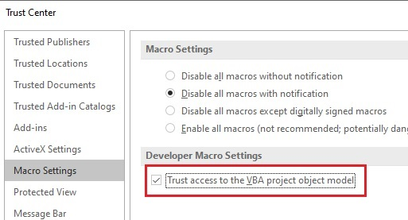
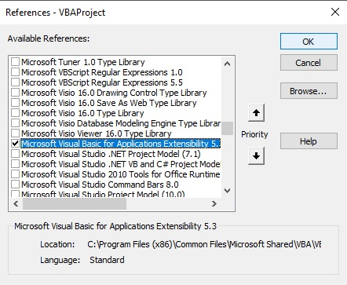

# Export / Import VBA Modules

After working on some big VBA projects, I found that exporting modules one by one can be very time-consuming. Unfortunately, I wasn't able to find any projects on the internet that didn't require installation, and that worked the way I wanted.
 
I was looking for a tool that could do the job of easily exporting and importing VBA modules, so I could track changes in my code using GIT (few people use source control with VBA). Therefore, I decided to create this user-friendly tool that does the job. I hope you like it!

## Setup

1 - Download the files and extract the folder [git-export-import-vba](git-export-import-vba/) to the desired directory. This folder contains:

* [gitExportImport.frm](git-export-import-vba/gitExportImport.frm) - The userform code;
* [gitExportImport.frx](git-export-import-vba/gitExportImport.frx) - Binary file containing the userform controls, images, etc;
* [gitExportImportShared.bas](git-export-import-vba/gitExportImportShared.bas) - Other subs and functions.

2 - After extracting the folder, follow these steps:

* Open your Excel Workbook;
* Go to developer tab (enable it first, if not already);
* Click on Macro Security;
* Enable Trust access to the VBA project object model checkbox;

* Open the VBA editor;
* Go to tools;
* References;
* Find Microsoft Visual Basic for Applications Extensibility 5.3 and add it.

3 - Finally, follow the steps below:

* Inside the VBA editor, go to Files;
* Import files;
* Go to the folder you extracted;
* Import [gitExportImport.frm](git-export-import-vba/gitExportImport.frm);
* Follow step 3 again and import [gitExportImportShared.bas](git-export-import-vba/gitExportImportShared.bas)

If everything worked well, inside <i>Forms</i> you should have <i>gitExportImport</i> and inside <i>Modules</i>, <i>gitExportImportShared</i>.

You are now all set! 

IMPORTANT: If after importing <i>gitExportImport.frm</i> it goes under <i>Modules</i> in your VBA editor (happened when testing with Office 365), you must follow the steps below:

* Remove the <i>gitExportImport.frm</i> module from your VBA editor.
* Go to the folder you extracted in step 1;
* Open [gitExportImport.frm](git-export-import-vba/gitExportImport.frm) with notepad;
* Copy the code;
* Delete [gitExportImport.frm](git-export-import-vba/gitExportImport.frm);
* Create a new .txt file inside the same folder;
* Paste the code you copied;
* Save the file and rename it to <i>gitExportImport.frm</i>.
* Go back to step 3 and everything should be fine.
